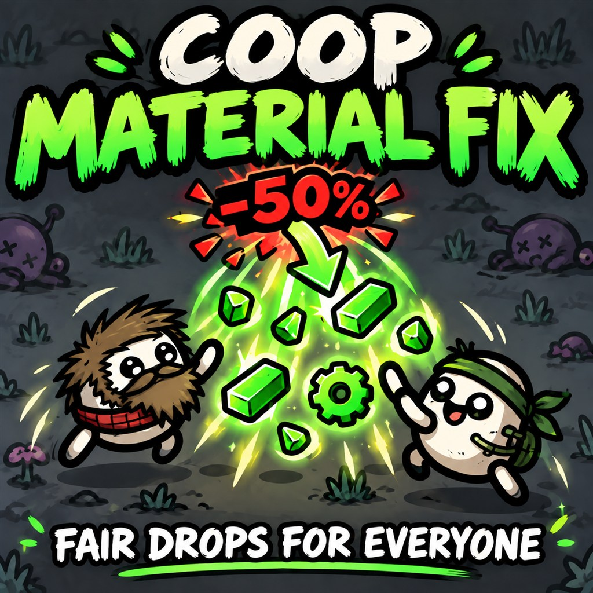
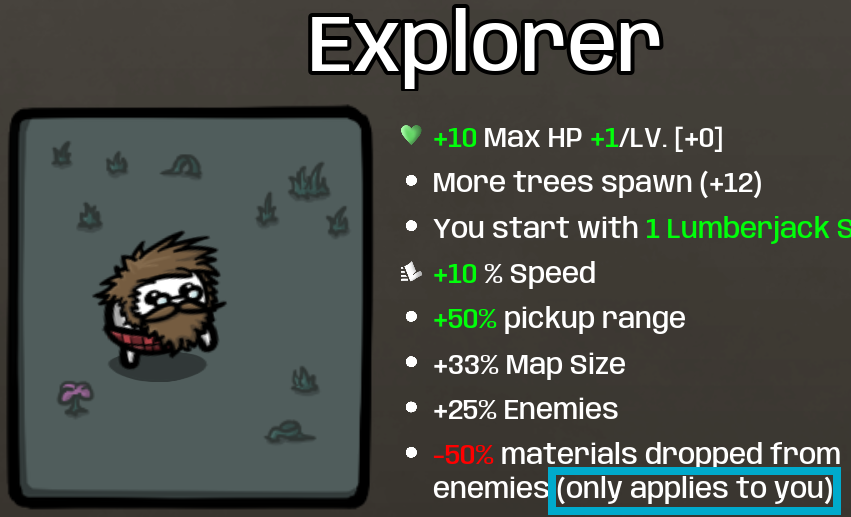

<div align="center">



# 🥔 Co-op Material Fix

**Negative material-drop penalties should hurt the character who has them — not your whole co-op party.**

[](https://steamcommunity.com/sharedfiles/filedetails/?id=3808621609)
[](https://steamcommunity.com/sharedfiles/filedetails/?id=3808621609)


### [➡️ Get it on the Steam Workshop](https://steamcommunity.com/sharedfiles/filedetails/?id=3808621609)

</div>

---

## 💥 The problem

In vanilla Brotato co-op, a character's negative material modifier is
**averaged across the whole party** (`sum of all players' effects ÷ player count`)
and then applied to every drop — for everyone.

In a 2-player run with Streamer, **both** players lose 25% of their materials.
Your teammate pays half of *your* character's downside, and you only pay half
of what your tooltip says. Pick Streamer or Fisherman with a friend and you're
quietly griefing their run.

## 🧑‍🤝‍🧑 Fixed characters

Every character that ships with a negative material-drop modifier, verified
against the game data of Brotato 1.1.15.4 and the Abyssal Terrors DLC:

| | Character | Source | Penalty | 😢 Vanilla co-op | 😎 With this mod |
|:-:|---|:-:|---|---|---|
| 🎥 | **Streamer** | Base game | `-50% materials dropped` | **Everyone** loses 50% ÷ players (2p: −25% each) | Teammates: **full** drops · Streamer: −50% |
| 🌾 | **Farmer** | Base game | `-50% materials dropped` | **Everyone** loses 50% ÷ players (2p: −25% each) | Teammates: **full** drops · Farmer: −50% |
| 🥾 | **Hiker** | Abyssal Terrors | `-50% materials dropped` | **Everyone** loses 50% ÷ players (2p: −25% each) | Teammates: **full** drops · Hiker: −50% |
| 🎣 | **Fisherman** | Base game | `-50% materials dropped from enemies` | **Everyone** loses 50% ÷ players of enemy drops | Teammates: **full** drops · Fisherman: −50% enemy drops |
| 🧭 | **Explorer** | Base game | `-50% materials dropped from enemies` | **Everyone** loses 50% ÷ players of enemy drops | Teammates: **full** drops · Explorer: −50% enemy drops |
| 👣 | **Cryptid** | Base game | `-50% materials dropped from enemies` | **Everyone** loses 50% ÷ players of enemy drops | Teammates: **full** drops · Cryptid: −50% enemy drops |
| 🏴‍☠️ | **Buccaneer** | Abyssal Terrors | `-50% materials dropped from enemies` | **Everyone** loses 50% ÷ players of enemy drops | Teammates: **full** drops · Buccaneer: −50% enemy drops |

> [!NOTE]
> **Positive** material modifiers stay shared, exactly as vanilla intends —
> e.g. Jack's `+200% materials dropped`, or items like Evil Hat and Starfish.
> Enemy-only penalties (`… from enemies`) never touch tree or other non-enemy
> materials.

<details>
<summary>🎲 Stacking example: Streamer + Fisherman + two normal characters</summary>

| Player | Vanilla: tree | Vanilla: enemy | Mod: tree | Mod: enemy |
|---|:-:|:-:|:-:|:-:|
| 🎥 Streamer | 88% | 76% | 50% | 50% |
| 🎣 Fisherman | 88% | 76% | **100%** | 50% |
| 🧑 Normal | 88% | 76% | **100%** | **100%** |
| 🧑 Normal | 88% | 76% | **100%** | **100%** |

Vanilla spreads both penalties over all four players (−12% each, stacked to −24%
on enemy drops). With the mod, each penalty lands only on the character who
chose it, at its full tooltip value.

</details>

## ✅ The fix

Co-op Material Fix intercepts the drop calculation, strips out negative
CHARACTER-owned `gold_drops` / `enemy_gold_drops` effects while the *shared*
world material value is computed, then re-applies each penalty **only** to
that character's own final share.

```
🪙 material drops
  ├─ 🧑 Player A (Streamer, -50%)  → penalty applies to A only
  └─ 🧑 Player B (Normal)          → full, unpenalized share
```

Enemy vs. tree/neutral origin is tracked per material node, so an enemy-only
penalty never bleeds onto tree drops — no matter who lands the kill.

```
👹 Enemy killed  → 🪙 drop tagged ENEMY   → Fisherman penalty applies
🌳 Tree chopped  → 🪙 drop tagged NEUTRAL → Fisherman penalty does NOT apply
```

Everything else — Metal Detector, round-robin pickup splitting, XP gain,
Builder's floor-material conversion — runs through **unmodified vanilla
code**, untouched.

## 🏷️ In-game labels

Affected character lines are annotated so the effect is never a mystery:

> `-50% materials dropped` **(only applies to you)**
> `-50% materials dropped from enemies` **(only applies to you)**



Works in vanilla tooltips and with [ImprovedTooltips](https://steamcommunity.com/sharedfiles/filedetails/?id=3019195689).

## 🧩 Compatibility

| | |
|---|---|
| ✅ Solo | Untouched — fix is a co-op-only code path |
| ✅ 2–4 player co-op | Fully supported |
| ✅ Multiple affected players | Each penalty applies independently |
| ✅ Abyssal Terrors DLC | Hiker and Buccaneer covered |
| ✅ ImprovedTooltips | Label hooks into its tooltip builder (optional dependency) |
| ⚠️ Other `main.gd` / `run_data.gd` extenders | Load-order sensitive — see full audit below |

<details>
<summary>📋 Full edge-case audit (click to expand)</summary>

- 1-value pickups keep fractional carry-over — a 50% penalty stays a true
  50% over time instead of truncating every pickup to 0
- 50-material on-ground cap: mixed-source blobs keep exact source composition
- Bonus-material bag across waves: source composition retained
- Builder conversion receives the unpenalized shared floor pool
- Positive / non-character / `neutral_gold_drops` effects: unaffected, shared as vanilla intends
- Metal Detector and picker `increase_material_value`: still rolled by vanilla first
- XP gain: calculated inside vanilla `add_xp()`, after the personal material share
- Unknown/custom material spawns classified as OTHER — enemy-only penalties never guessed

Full writeup with method-level detail:
[`mods-unpacked/HunTTer-CoopMaterialFix/README.md`](mods-unpacked/HunTTer-CoopMaterialFix/README.md)

</details>

## 🚀 Install

1. **[Subscribe on the Steam Workshop](https://steamcommunity.com/sharedfiles/filedetails/?id=3808621609)**
2. Launch Brotato → **Mods** → enable **CoopMaterialFix** → restart

🪵 Something not showing up? Check `%APPDATA%\Brotato\logs\modloader.log`.

## 📦 Repo layout

```
mods-unpacked/HunTTer-CoopMaterialFix/
├── manifest.json
├── mod_main.gd
└── extensions/
    ├── main.gd                                # world-drop value adjustment, gold source bookkeeping
    ├── singletons/run_data.gd                 # personal penalty + pickup capture/re-add
    ├── singletons/text_improved_tooltips.gd   # UI label under ImprovedTooltips (installed only if present)
    └── items/global/effect_line.gd            # UI label in vanilla tooltips
makezip.py                                     # packages mods-unpacked/ into a distributable zip
```

---

<div align="center">
<sub>Made by HunTTer · Target: Brotato 1.1.15.4 · ModLoader 6.2 · Godot 3.7</sub>
</div>
